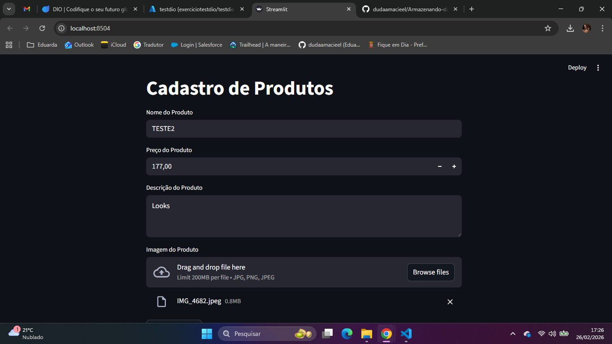
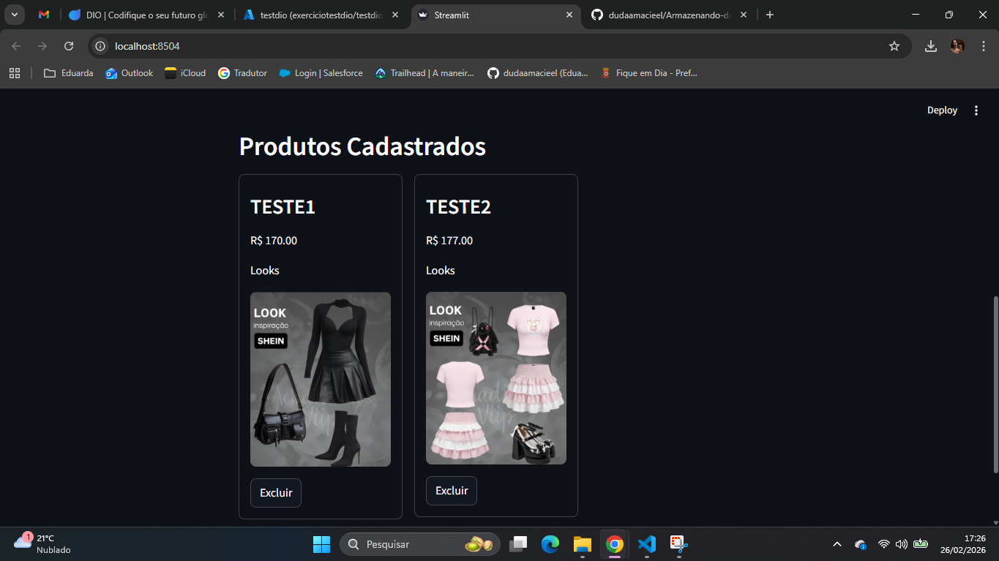
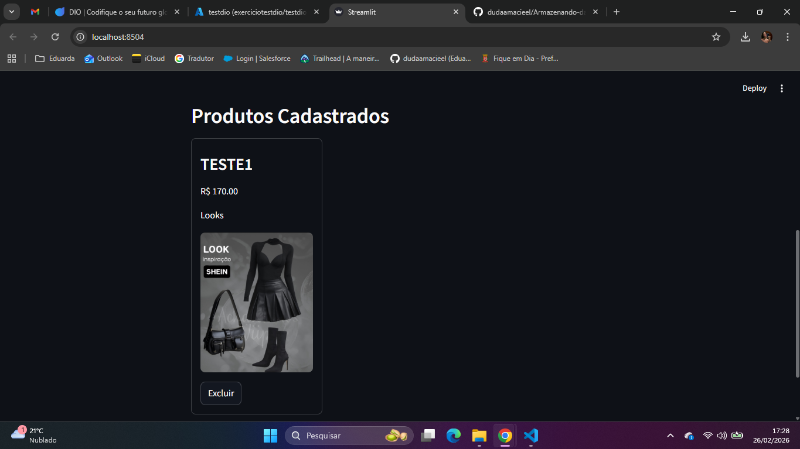
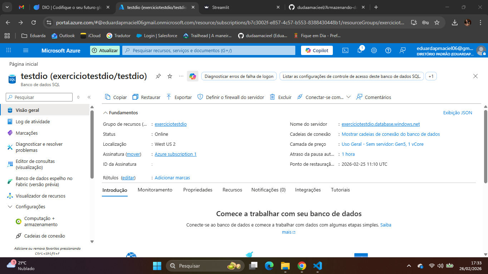

# Armazenando dados de um ECommerce na Cloud

## Objetivo:

Projeto desenvolvido durante o curso da DIO com foco na Microsoft Application Platform, simula um Ecommerce utilizando serviços em nuvem da Microsoft Azure.

A aplicação permite cadastrar produtos, armazenar imagens na nuvem e registrar as informações em um banco de dados cloud, demonstrando a integração entre diferentes serviços da plataforma Azure.

Além da aplicação principal, foi criada uma camada de gerenciamento de  APIs utilizando o Azure API Management. A API foi protegida utilizando autenticação baseada em JWT (Json Web Token), garantindo que apenas clientes autenticados consigam acessar os endpoints.

Além disso, foi desenvolvido um serviço autenticador de boletos que permite gerar tokens únicos e validar códigos de barras de boletos, integrando com Azure Service Bus para envio e processamento assíncrono das validações.

Foi desenvolvido tambem um projeto criado com apoio do Copilot no VS Code, com foco em praticar lógica de programação, animações e conceitos básicos de física aplicados a jogos. 

## Tecnologias utilizadas:

- Python
- Streamlit
- Azure SQL Database 
- Azure Blob Storage
- PyODBC
- Dotenv
- Azure API Management
- JWT Authentication
- Policies no APIM
- Azure Functions (.NET 6)
- Azure Service Bus
- JavaScript
- HTML5 Canvas
- Postman

## Funcionamento:

1. O usuário cadastra um produto via interface Streamlit.
2. A imagem é enviada para o Azure Blob Storage.
3. As informações do produto são armazenadas no Azure SQL Database.
4. Os produtos são exibidos dinamicamente na interface. 
5. É possível excluir produtos diretamente da aplicação.
6. O serviço autenticador de boletos permite que o usuário envie um código de barras ou solicite um token via API.
7. A validação do boleto é feita pela Azure Function e caso seja válida, a mensagem é enviada para a fila do Azure Service Bus.

## Como executar:

1. Clone o reposiótio.
2. Crie um ambiente virtual.
3. Ative o ambiente virtual.
4. Instale as dependências.
5. Configure o arquivo .env com suas credenciais e endpoints.
6. Execute a aplicação.

## Como executar o jogo:

1. Acesse a pasta do projeto do jogo.
2. Abra o arquivo index.html no navegador.

## Fluxo de autenticação da API

1. O cliente solicita um token JWT.
2. O token é enviado no header 'Authorization'.
3. O Azure API Management valida o token utilizando uma policy JWT.
4. Caso o token seja válido, a requisição é encaminhada para a aplicação.

## Serviço Autenticador de Boletos 

1. Clone o repositório (ou acesse a pasta do projeto).
2. Execute o Azure Functions:
   - func start
3. Configure o local.settings.json com:
   - ServiceBusConnectionString
   - QueueName
4. Teste os endpoints:
   - Geração de token: POST /api/gerar-token
   - Validação de boleto: POST /api/validar-boleto

## Aprendizados e Insights:

Durante o processo do desenvolvimento deste projeto, foram executados conceitos como:
- Conexão segura com o banco de dados na nuvem.
- Utlização de variáveis de ambiente para segurança.
- Upload e gerenciamento de arquivos no Azure Blob Storage.
- Integração entre serviços cloud.
- Estruturação de aplicações web com Streamlit.
- Criação de serviços serverless para autenticação de boletos.
- Geração e validação de tokens únicos para segurança de APIs.

## Print's da Aplicação: Armazenando Dados

Tela inicial:

Produtos listados:

Produto sendo excluído:

Azure SQL:

## Print's da Aplicação: Docker Azure Container App

Tela inicial:

Produtos listados:

Azure Resource Group:

## Print's da Aplicação: APIs Management com Azure e JWT

Tela inicial:

Policy JWT:

API Overview:

Curl Token:

Curl API:

## Print's da Aplicação: Serviço Autenticador de Boletos

Gerando o token: 

Validando o código de barras:

Tela inicial: 

Validando o código de barras:

Service Bus Queue:

## Demonstração do Jogo:

